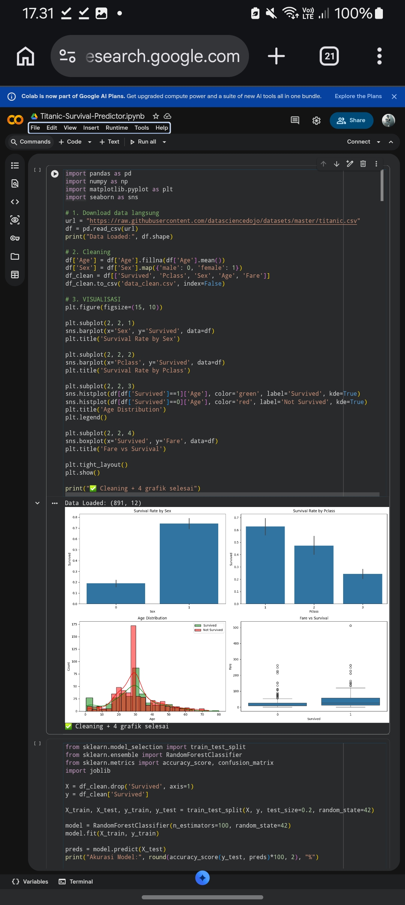

# 🚢 Titanic Survival Prediction

Predict passenger survival on the Titanic using Logistic Regression and other ML models.  
Built and trained 100% on Google Colab.

### 🛠️ Tech Stack
`Python` `Pandas` `Scikit-learn` `Matplotlib` `Seaborn` `Pickle` `Google Colab`

### 📊 Model Performance
- **Algorithm**: Logistic Regression
- **Accuracy**: [Add your accuracy here]%
- **Features**: Pclass, Sex, Age, Fare, SibSp, Parch
- **Dataset**: Titanic Train Dataset

### 📈 Results

### 🚀 How to Run
1. Open `Titanic_Survival_Predictor.ipynb` in Google Colab
2. Upload `data_clean.csv` or original Titanic dataset
3. Run all cells to train and evaluate the model

### 💡 Key Learning
Data cleaning, feature engineering, handling missing values, model training, and saving model with pickle.
